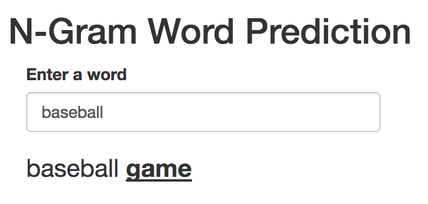

```{r setup, include=FALSE}
knitr::opts_chunk$set(echo = FALSE)
```

## Summary

In the fields of computational linguistics and probability, an n-gram is a contiguous sequence of n items from a given sequence of text or speech. The n-grams typically are collected from a text or speech corpus. An n-gram of size 1 is referred to as a "unigram"; size 2 is a "bigram" (or, less commonly, a "digram"); size 3 is a "trigram". Larger sizes are sometimes referred to by the value of n in modern language, e.g., "four-gram", "five-gram", and so on. (Source: https://en.wikipedia.org/wiki/N-gram)  

## N-Gram Word Prediction Shiny App 

<https://tjaensch.shinyapps.io/ngram_word_prediction/>



## Technical Details

This app uses text samples of three large text files to create a corpus as source text for the n-gram algorithm which is saved as an .RData file. That file is then tokenized into bigrams, trigrams, and fourgrams, sorted by n-gram frequency, and stored in three .RData files for bigrams, trigrams, and fourgrams that can be used by the application to look up word sequences.

## Limitations

* Punctuation is currently completely ignored 
* Languages other than English are completely ignored
* Spelling mistakes are not handled

**Thank you!**

